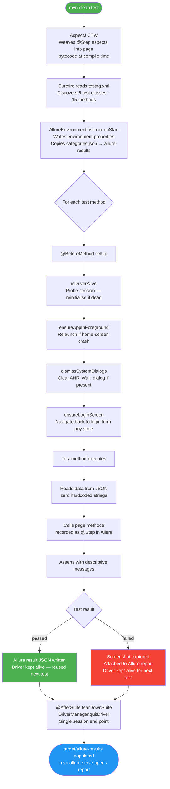
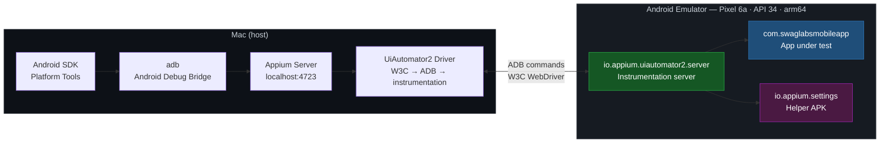
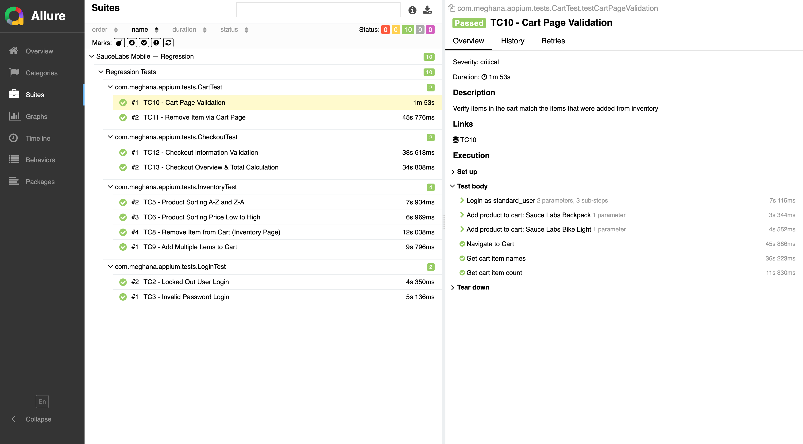

# Appium Mobile Test Automation Framework


A production-grade Android test automation framework built with **Appium 2.0 + Java** for the SauceLabs Mobile Sample app. Covers 15 end-to-end scenarios across Login, Inventory, Cart, Checkout, and Navigation — producing rich Allure reports with step-level tracing, failure screenshots, and severity classification.

The framework reflects real-world QA engineering standards: resilient to emulator ANR dialogs and session crashes, fully data-driven with zero hardcoded test values, and organised into clean independently testable layers.

---

## Table of Contents

- [Architecture Overview](#architecture-overview)
- [Framework Workflow](#framework-workflow)
- [Design Patterns](#design-patterns)
- [Key Features](#key-features)
- [Project Structure](#project-structure)
- [Tools & Plugins](#tools--plugins)
- [Appium Setup](#appium-setup)
- [How to Run Tests](#how-to-run-tests)
- [Allure Reports](#allure-reports)
- [Cloud Execution — BrowserStack](#cloud-execution--browserstack)

---

## Architecture Overview

```mermaid
flowchart TD
    AUT["APPLICATION UNDER TEST\nSauceLabs Mobile Sample App v2.7.1\ncom.swaglabsmobileapp — Android 14 (API 34)\nEmulator: Pixel 6a · arm64-v8a"]

    subgraph EXEC ["TEST EXECUTION LAYER"]
        E1["Local Emulator\nmvn clean test"]
        E2["Smoke Suite\ntestng-smoke.xml · 5 tests"]
        E3["Regression Suite\ntestng-regression.xml · 10 tests"]
    end

    subgraph DRIVER ["DRIVER LAYER  (driver/)"]
        DM["DriverManager — ThreadLocal Singleton\n──────────────────────────────────\ninitDriver()     Creates Appium session\ngetDriver()      Returns thread-local AndroidDriver\nquitDriver()     Ends session + removes ThreadLocal\ndismissSystemDialogs()  Clears ANR 'Wait' dialogs\nRetry logic: 3 attempts × 20s delay"]
    end

    subgraph PAGES ["PAGE OBJECT LAYER  (pages/)"]
        direction LR
        BP["BasePage  Abstract\n────────────────────\nclick(By)  waitForClickable → click\ntype(By, text)  waitForVisible → clear → sendKeys\ngetText(By)  waitForVisible → getText\nisDisplayed(By)  safe boolean\nfindAll(By)  → List<WebElement>\nwaitForVisibleDismissingDialogs()  ANR-aware wait\nwaitForPageLoad()  abstract"]
        PO["Concrete Pages\n────────────────────\nLoginPage\nInventoryPage\nCartPage\nCheckoutInfoPage\nCheckoutOverviewPage\nCheckoutCompletePage\nSidebarPage"]
    end

    subgraph UTILS ["UTILITY LAYER  (utils/)"]
        direction LR
        WW["WebDriverWaitUtils\n──────────────────\nwaitForVisible\nwaitForClickable\nwaitForText\nwaitForInvisibility\nwaitForPresence\nwaitForElementCount"]
        GU["GestureUtils\n──────────────────\ntap · doubleTap\nlongPress · swipe\nscroll(Direction)\nswipeToElement(By)\npinchOrZoom"]
        CU["CommonUtils\n──────────────────\ntakeScreenshot\nparsePriceString\ngenerateRandomString\nwaitForSeconds"]
        JD["JsonDataReader\n──────────────────\ngetText · getDouble\ngetInt · getBoolean\nasDataProviderArray\nJackson ObjectMapper"]
        CR["ConfigReader\n──────────────────\nSingleton\nget · getInt\ngetBoolean\nconfig.properties"]
    end

    subgraph TESTS ["TEST LAYER  (tests/)"]
        TC["5 Test Classes · 15 Scenarios\n────────────────────────────────────\n@Epic  @Feature  @Story  @TmsLink  @Severity\n@Step woven at compile time (AspectJ CTW)\nMarkers: smoke · regression\nData: users.json · checkout.json"]
    end

    subgraph REPORT ["ALLURE REPORT OUTPUT"]
        R["Feature/Story hierarchy · Severity badges\nStep timelines · Failure screenshots\nEnvironment panel · categories.json\nOverview · Behaviors · Suites · Timeline"]
    end

    AUT --> EXEC
    EXEC --> DRIVER
    DRIVER --> PAGES
    PAGES --> UTILS
    UTILS --> TESTS
    TESTS --> REPORT
```



---

## Framework Workflow



---

## Design Patterns

- **Singleton + ThreadLocal** — `DriverManager` holds one `AndroidDriver` per thread via `ThreadLocal`. The session is created once before the first test, reused across all 15 tests, and quit only in `@AfterSuite`. This avoids the 10–20 second Appium session startup cost on every test and keeps parallel execution safe without shared driver state.

- **Page Object Model** — Every screen has a dedicated class in `pages/` owning all locators and interactions. Page Factory is intentionally not used — it caches element references at init time and causes `StaleElementReferenceException` when app state changes. Every method resolves elements fresh against the live DOM.

- **Template Method** — `BasePage` is abstract and defines the contract: `waitForPageLoad()` must be implemented by every concrete page. Shared helpers (`click`, `type`, `getText`, `isDisplayed`) live in the base class so each page gets them for free while only filling in the screen-specific wait logic.

- **Fluent Interface** — Page methods return `this` or the next page object, so tests read as natural language: `loginPage.enterUsername(u).enterPassword(p).tapLogin()`.

- **Factory Method** — Navigation methods construct, wait for, and return the next page. The caller never instantiates a page directly — `proceedToCheckout()` builds the `CheckoutInfoPage`, calls `waitForPageLoad()`, and returns it ready to use.

- **Data-Driven** — All test inputs live in `users.json` and `checkout.json`. `JsonDataReader` wraps Jackson with a fluent key-path API so test classes contain zero hardcoded strings: `USERS.getText("errorMessages", "lockedOut")`.

- **Strategy — ANR Handling** — `BasePage.waitForVisibleDismissingDialogs()` applies a two-attempt strategy: primary wait → catch timeout → dismiss ANR "Wait" dialog → retry. Composed into every `waitForPageLoad()` call automatically, so individual tests need no ANR awareness.

---

## Key Features

### 🔄 Resilient Session Management

- **Retry logic** — `DriverManager.initDriver()` retries session creation up to 3 times with 20-second delays. After an abnormal session end, the emulator's `settings` ContentProvider is briefly unavailable; the delay lets Android recover before the next attempt.
- **`ignoreHiddenApiPolicyError: true`** — skips the hidden API policy configuration step when the `settings` ContentProvider is not yet available, preventing `SessionNotCreated` on restricted emulators.
- **`isDriverAlive()` probe** — `@BeforeMethod` pings the session before each test. If the session has died, it reinitialises without failing the test or the suite.
- **`ensureLoginScreen()`** — navigates back to login from any app state (cart, checkout, sidebar open) using UI-level logout, so each test starts from a known baseline without session teardown.

### 📊 Data-Driven Architecture

- **Zero hardcoded test values** in any test class — all inputs sourced from `users.json` and `checkout.json`
- `JsonDataReader` wraps Jackson `ObjectMapper` with a fluent key-path API: `USERS.getText("validUser", "username")`
- Error messages, product names, prices, postal codes, expected totals — all externalised
- `config.properties.template` committed to git; real device config excluded via `.gitignore`

### 📱 ANR Resilience — Three Levels

Android ANR (App Not Responding) dialogs appear under emulator load and block all automation. The framework handles them at three independent levels:

| Level | Where | Behaviour |
|---|---|---|
| **1 — Session init** | `DriverManager.initDriver()` | Calls `dismissSystemDialogs()` immediately after session creation |
| **2 — Page load** | `BasePage.waitForVisibleDismissingDialogs()` | Wraps every `waitForPageLoad()` — catches timeout, taps "Wait", retries |
| **3 — Gestures** | `GestureUtils.swipeToElement()` | Dismisses dialogs between each scroll attempt |

### 🎭 W3C Gestures

All touch interactions use the **W3C Actions API** (`PointerInput` + `Sequence`). The deprecated Appium `TouchAction` was removed in Java Client 8+.

```java
PointerInput finger = new PointerInput(PointerInput.Kind.TOUCH, "finger");
Sequence scroll = new Sequence(finger, 0)
    .addAction(finger.createPointerMove(Duration.ZERO, VIEWPORT, startX, startY))
    .addAction(finger.createPointerDown(PointerInput.MouseButton.LEFT.asArg()))
    .addAction(finger.createPointerMove(Duration.ofMillis(600), VIEWPORT, endX, endY))
    .addAction(finger.createPointerUp(PointerInput.MouseButton.LEFT.asArg()));
driver.perform(List.of(scroll));
```

| Method | Description |
|---|---|
| `tap(x, y)` / `tap(element)` | Single finger tap |
| `doubleTap(x, y)` | Two rapid taps with 100ms gap |
| `longPress(element, duration)` | Press and hold (default 1 500ms) |
| `swipe(startX, startY, endX, endY)` | Linear drag between two points |
| `scroll(Direction, fraction)` | Scroll by fraction of screen height |
| `swipeToElement(By, maxSwipes)` | Scroll until element is visible (dismisses ANR between attempts) |
| `pinchOrZoom(centerX, centerY, distance, zoomIn)` | Two-finger pinch or spread |

### 📈 Allure Reporting

Every test is decorated with the full Allure metadata stack:

```java
@Epic("SauceLabs Mobile App")
@Feature("Checkout")
@Story("Complete end-to-end purchase journey")
@TmsLink("TC14")
@Severity(SeverityLevel.BLOCKER)
```

| Allure Feature | Implementation |
|---|---|
| Feature / Story hierarchy | All 15 tests categorised across 5 features |
| Severity levels | BLOCKER (smoke), CRITICAL / NORMAL (regression) |
| Step timelines | `@Step` woven at compile time via AspectJ CTW |
| Failure screenshots | Auto-attached in `@AfterMethod` via `CommonUtils.takeScreenshot()` |
| `environment.properties` | Device, platform, app package, Appium URL — auto-generated per suite |
| `categories.json` | Product defects (AssertionError), ANR, Element not found, Driver issues, Skipped |

### ⚙️ Compile-Time AspectJ Weaving

Allure's `@Step` annotations are woven into page method bytecode at `mvn compile` by `dev.aspectj:aspectj-maven-plugin`. Load-time weaving (LTW javaagent) was explicitly avoided — it fails on Java 17+ due to module encapsulation. CTW runs entirely at build time with no runtime classloader dependency.

---

## Project Structure

```
appium-java-project/
│
├── pom.xml                              Maven build, dependencies, plugins
├── testng.xml                           Full suite (15 tests)
├── testng-smoke.xml                     Smoke suite (5 tests)
├── testng-regression.xml                Regression suite (10 tests)
├── .gitignore
├── docs/
│   └── allure-screenshots/              Allure report screenshots for README
│
└── src/
    ├── main/java/com/meghana/appium/
    │   │
    │   ├── driver/
    │   │   └── DriverManager.java       Singleton + ThreadLocal + retry logic + ANR dismissal
    │   │
    │   ├── pages/
    │   │   ├── BasePage.java            Abstract base — helpers + ANR-safe wait + Template Method
    │   │   ├── LoginPage.java
    │   │   ├── InventoryPage.java
    │   │   ├── CartPage.java
    │   │   ├── CheckoutInfoPage.java
    │   │   ├── CheckoutOverviewPage.java
    │   │   ├── CheckoutCompletePage.java
    │   │   └── SidebarPage.java
    │   │
    │   └── utils/
    │       ├── WebDriverWaitUtils.java  All explicit wait wrappers
    │       ├── GestureUtils.java        W3C Actions API — tap, scroll, swipe, pinch
    │       ├── CommonUtils.java         Screenshot, price parse, random string
    │       ├── JsonDataReader.java      Jackson-based JSON test data reader
    │       └── ConfigReader.java        Singleton config.properties reader
    │
    └── test/
        ├── java/com/meghana/appium/
        │   ├── base/
        │   │   └── BaseTest.java        Lifecycle, session recovery, state reset, teardown
        │   ├── listeners/
        │   │   └── AllureEnvironmentListener.java  Writes environment.properties + copies categories.json
        │   └── tests/
        │       ├── LoginTest.java       TC1, TC2, TC3
        │       ├── InventoryTest.java   TC4, TC5, TC6, TC7, TC8, TC9
        │       ├── CartTest.java        TC10, TC11
        │       ├── CheckoutTest.java    TC12, TC13, TC14
        │       └── NavigationTest.java  TC15
        │
        └── resources/
            ├── config.properties        [GITIGNORED] Device paths + Appium URL
            ├── config.properties.template  Safe placeholder (committed)
            ├── allure.properties
            ├── categories.json          Allure failure classification rules
            ├── logback-test.xml
            └── testdata/
                ├── users.json           Credentials + error messages
                └── checkout.json        Names, postal codes, expected totals
```

---

## Tools & Plugins

| Tool / Plugin | Version | Purpose |
|---|---|---|
| **Java** | 17 | Runtime (LTS — required by Appium Client 9.x) |
| **Appium Java Client** | 9.1.0 | Android automation client — `AndroidDriver`, `UiAutomator2Options`, `AppiumBy` |
| **Selenium WebDriver** | 4.18.1 (pinned) | W3C WebDriver protocol — pinned to prevent breaking changes from Appium session handshake |
| **UiAutomator2 Driver** | via Appium 2.0 | Android instrumentation — translates W3C commands to ADB + UiAutomator2 |
| **TestNG** | 7.10.2 | Test runner — XML suites, groups, listeners, `@BeforeMethod` / `@AfterSuite` |
| **Allure TestNG** | 2.27.0 | Generates Allure result JSON during test run |
| **Allure Java Commons** | 2.27.0 | `@Step`, `@Epic`, `@Feature`, `@Story`, `@Severity`, `Allure.addAttachment()` |
| **AspectJ (CTW)** | 1.9.22 | Compile-time weaving of `@Step` aspects into page method bytecode |
| **Jackson Databind** | 2.17.1 | JSON test data parsing — `ObjectMapper`, `JsonNode` |
| **SLF4J + Logback** | 2.0.13 / 1.5.6 | Structured logging throughout framework |
| **Maven Surefire** | 3.2.5 | Runs TestNG suites, injects AspectJ `-javaagent` |
| **Allure Maven** | 2.12.0 | `mvn allure:serve` and `mvn allure:report` |

---

## Appium Setup

### Appium Server

```bash
# Install Appium 2.0
npm install -g appium

# Install the UiAutomator2 driver for Android
appium driver install uiautomator2

# Verify
appium driver list --installed

# Start the server
appium
```

### Appium Inspector

Appium Inspector is a standalone GUI tool for inspecting element hierarchies on a live device or emulator. Used throughout this project to identify and verify locators before writing them into page classes.

**Workflow:**
1. Start Appium server (`appium`)
2. Launch Appium Inspector (desktop app)
3. Enter the same capabilities from `config.properties`
4. Click **Start Session** — the device screen mirrors in Inspector
5. Click any element → see its `content-desc`, `resource-id`, `class`, `text`
6. Copy `content-desc` → use as `byAccessibilityId("test-*")` in the page class

**Why Accessibility ID?** The SauceLabs app uses consistent `test-*` content-description attributes on all interactive elements. These are stable across app versions, semantic, and faster to resolve in UiAutomator2 than XPath. XPath is used only when no `content-desc` is available.

### Android Platform



**Emulator start command:**

```bash
emulator -avd Pixel_6a_Edited_API_34 \
  -no-snapshot-load \
  -gpu host \
  -no-boot-anim \
  -no-audio \
  -memory 1536
```

> `-gpu host` is required on Apple Silicon — `-gpu swiftshader_indirect` (CPU rendering) starves the system under load and causes System UI ANR dialogs.

---

## How to Run Tests

### Prerequisites

```bash
java -version                       # Java 17+
mvn -version                        # Maven 3.x
echo $ANDROID_HOME                  # Android SDK path
emulator -list-avds                 # Confirm AVD exists
appium --version                    # Appium 2.0+
appium driver list --installed      # UiAutomator2 listed
```

### Configuration

```bash
# Copy the template and fill in your device details
cp src/test/resources/config.properties.template \
   src/test/resources/config.properties
```

```properties
# src/test/resources/config.properties
appiumServerUrl=http://127.0.0.1:4723
platformName=Android
automationName=UiAutomator2
deviceName=emulator-5554
appPackage=com.swaglabsmobileapp
appActivity=com.swaglabsmobileapp.MainActivity
noReset=true
newCommandTimeout=3600
```

### Start Emulator & Appium

```bash
# Terminal 1 — start emulator
emulator -avd <your-avd-name> -no-snapshot-load -gpu host -no-boot-anim -no-audio -memory 1536 &

# Wait for full boot
until [ "$(adb shell getprop sys.boot_completed 2>/dev/null)" = "1" ]; do sleep 3; done && echo "Boot complete"

# Terminal 2 — start Appium server
appium
```

### Run Tests

```bash
# Smoke suite — 5 critical-path tests, fastest feedback
mvn clean test -DsuiteXmlFile=testng-smoke.xml

# Regression suite — 10 tests covering errors, sorting, cart, checkout validation
mvn clean test -DsuiteXmlFile=testng-regression.xml

# Full suite — all 15 tests
mvn clean test
```

### Generate & View Allure Report

```bash
# Open interactive report in browser (recommended)
mvn allure:serve

# Generate static HTML report
mvn allure:report
open target/site/allure-maven-plugin/index.html

# Using Allure CLI directly
allure serve target/allure-results
```

### Test Suite Reference

| Suite | Tests | Estimated Time | What's Covered |
|---|---|---|---|
| `testng-smoke.xml` | 5 | ~10–15 min | TC1 Login · TC4 Inventory · TC7 Add to Cart · TC14 Full Checkout · TC15 Logout |
| `testng-regression.xml` | 10 | ~20–30 min | TC2–3 Login errors · TC5–6 Sorting · TC8–9 Cart ops · TC10–11 Cart page · TC12–13 Checkout validation |
| `testng.xml` | 15 | ~35–45 min | All of the above |

### ADB Troubleshooting

```bash
# ADB unresponsive
adb kill-server && adb start-server

# Remove stale UiAutomator2 APKs (fixes instrumentation crash)
adb uninstall io.appium.uiautomator2.server
adb uninstall io.appium.uiautomator2.server.test
adb uninstall io.appium.settings

# Check what's currently on screen
adb shell dumpsys window | grep mCurrentFocus

# Dismiss ANR dialog manually
adb shell input keyevent 82
```

---

## Allure Reports

| Report Section | What You See |
|---|---|
| **Overview** | Pass / fail / skip counts, duration, trend chart, severity breakdown |
| **Behaviors** | Epic → Feature → Story hierarchy with severity badges, all 15 tests |
| **Suites** | Tests grouped by class with step-level expansion |
| **Timeline** | Execution order and duration per test |
| **Categories** | Product defects (AssertionError) vs Test defects (ANR / timeout / driver) |
| **Environment** | Device, platform, app package, Appium server URL |

### Allure Environment Panel

Populated automatically by `AllureEnvironmentListener` before any test runs:

```
Device       emulator-5554
Platform     Android 14 (API 34)
App Package  com.swaglabsmobileapp
Appium       http://127.0.0.1:4723
Suite        testng-regression.xml
```

### Screenshots

**Overview — pass rate, severity breakdown, suite summary**


**Suites — tests grouped by class with step-level detail**



**Test Case Detail — full step trace, parameters, failure screenshot attached**


### Generate Report

```bash
# Interactive report — opens in browser automatically
mvn allure:serve

# Static HTML output
mvn allure:report

# Using Allure CLI directly
allure serve target/allure-results
```

---

## Cloud Execution — BrowserStack

The framework is architected to be cloud-ready. Switching from a local emulator to BrowserStack requires **only `DriverManager` changes** — no test code, no page objects, no utilities change.

### What Changes

```java
// Local emulator (current)
UiAutomator2Options options = new UiAutomator2Options()
    .setDeviceName("emulator-5554")
    .setAppPackage("com.swaglabsmobileapp");
AndroidDriver driver = new AndroidDriver(new URL("http://127.0.0.1:4723"), options);

// BrowserStack (swap in)
UiAutomator2Options options = new UiAutomator2Options()
    .setCapability("browserstack.user",  System.getenv("BS_USERNAME"))
    .setCapability("browserstack.key",   System.getenv("BS_ACCESS_KEY"))
    .setCapability("app",                "bs://your-app-upload-id")
    .setCapability("device",             "Samsung Galaxy S23")
    .setCapability("os_version",         "13.0")
    .setCapability("project",            "SauceLabs Mobile")
    .setCapability("build",              "Regression - " + LocalDate.now())
    .setCapability("name",               testName);
AndroidDriver driver = new AndroidDriver(new URL("https://hub.browserstack.com/wd/hub"), options);
```

### Why It Works Without Changes

- **W3C Actions API** — gestures are protocol-level; BrowserStack's UiAutomator2 grid speaks the same W3C standard
- **Accessibility ID locators** — `content-desc` attributes are resolved by UiAutomator2 on the device, not by the local driver
- **ThreadLocal driver** — `DriverManager` passes the same `AndroidDriver` to every layer regardless of where the session lives
- **No hardcoded URLs in tests** — the server URL lives only in `config.properties`

### What Stays the Same

| Component | Local | BrowserStack |
|---|---|---|
| All 15 test classes | unchanged | unchanged |
| All 7 page objects | unchanged | unchanged |
| WebDriverWaitUtils | unchanged | unchanged |
| GestureUtils (W3C) | unchanged | unchanged |
| JSON test data | unchanged | unchanged |
| Allure annotations | unchanged | unchanged |
| TestNG suites | unchanged | unchanged |

### iOS Extension Path

```
config.properties  →  add iosAppiumServerUrl, bundleId, XCUITest caps
DriverManager      →  add initIOSDriver() using XCUITestOptions
Page objects       →  parallel iOS versions with XCUITest locators
testng-ios.xml     →  new suite pointing at iOS test classes
```

The `ThreadLocal<AndroidDriver>` pattern generalises to `ThreadLocal<AppiumDriver>` (the parent class), enabling Android and iOS sessions to coexist in parallel execution.

---

<p align="center">Built with Appium 2.0 · Java 17 · TestNG · Allure · Maven</p>
